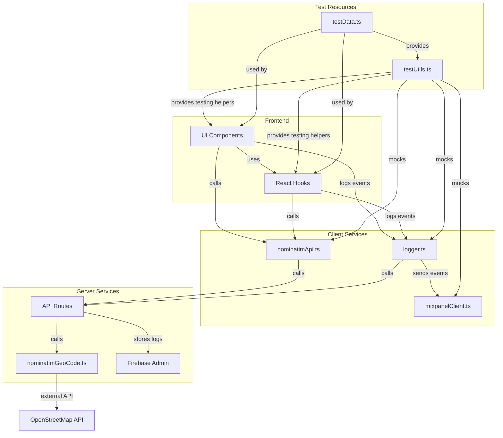

# Land Estimator Test Architecture

This document outlines the testing architecture used in the Land Estimator project.

## Test Architecture Diagram



## Key Testing Components

### 1. Test Utilities (`testUtils.ts`)

The `testUtils.ts` file contains reusable utility functions that standardize testing patterns across the codebase:

- **API Mocking**

  - `mockSuccessResponse` - Mocks successful API responses
  - `mockErrorResponse` - Mocks API error responses
  - `mockNetworkError` - Mocks network failures
  - `mockJsonParsingError` - Mocks JSON parsing errors

- **Component Testing**

  - `typeAndSelectSuggestion` - Automates address suggestion selection
  - `changeInputValue` - Simulates input field changes
  - `verifyUniqueSuggestions` - Validates uniqueness of suggestions
  - `getListItems` - Retrieves list items for assertion

- **Console Mocking**

  - `setupConsoleMocks` - Standardized console spying/mocking for error tests

- **Mock Factory Functions**
  - `createAddressLookupMock` - Creates mock implementations of the address lookup hook
  - `createNominatimApiClientMock` - Creates mock implementations of the API client

### 2. Test Data (`testData.ts`)

The `testData.ts` file contains standardized test data shared across tests:

- **Location Data**

  - `TEST_LOCATIONS` - Common test addresses (Google, Apple, etc.)
  - `TEST_COORDINATES` - Corresponding coordinates for test locations

- **Mock API Responses**

  - `mockSuggestions` - Simplified address suggestions
  - `mockNominatimResponses` - Full detailed API responses
  - `mockNominatimResponse` - Single API response

- **Error Objects**
  - `mockNominatimErrors` - Standardized error scenarios

### 3. Test Types

The project uses several types of tests:

- **Unit Tests**
  - Component tests - Verify rendering, interactions, and accessibility
  - Hook tests - Verify state management and lifecycle behavior
  - Service tests - Verify API interactions and error handling
- **Integration Tests**
  - API route tests - Verify proper request handling and responses
- **End-to-End Tests**
  - Cypress tests - Verify complete user journeys

## Testing Architecture Pattern

The project follows a layered testing approach:

1. **Components** are tested with mock hooks
2. **Hooks** are tested with mock services
3. **Services** are tested with mock API responses
4. **API Routes** are tested with mock database connections

This approach allows each layer to be tested in isolation while still providing confidence in the overall system.

## Nominatim Services Architecture

The project uses two complementary services for address lookups:

1. **nominatimGeoCode.ts** (Server-side)

   - Directly interfaces with the external OpenStreetMap Nominatim API
   - Handles raw data transformation and error management
   - Used by internal API routes

2. **nominatimApi.ts** (Client-side)
   - Provides a client-side wrapper for internal API endpoints
   - Handles client-side error states
   - Used by React hooks and components

This separation follows the best practice of isolating external API dependencies and providing a consistent interface for frontend components.

## Best Practices for Writing Tests

1. Use the standard test utilities and data from `testUtils.ts` and `testData.ts`
2. Follow the established mocking patterns for consistent test behavior
3. Test both success and failure scenarios
4. For components, test rendering, interactions, and accessibility
5. For hooks, test state transitions and side effects
6. For services, test API formatting and error handling

## Running Tests

```bash
# Run all tests
npm test

# Run tests in watch mode
npm run test:watch

# Run tests with coverage
npm run test:coverage

# Run specific test file
npx vitest src/path/to/test.ts

# Run end-to-end tests
npm run test:e2e
```
